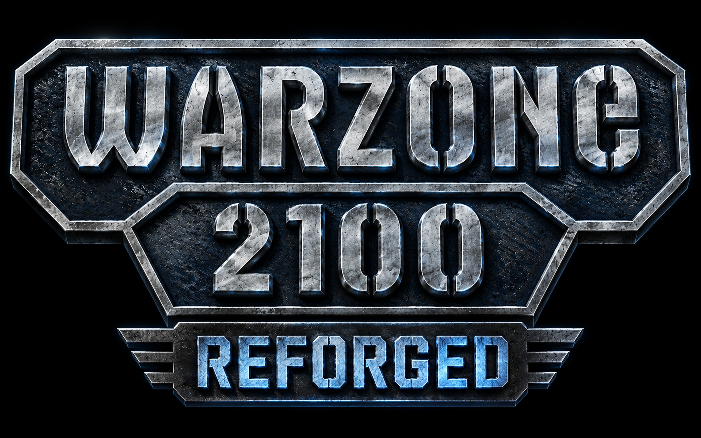

<h1 align="center">
  
</h1>

<p align="center"><b>Un progetto DedrisStudios</b> — remaster non ufficiale di <a href="https://wz2100.net/">Warzone 2100</a>, lo storico RTS 3D open source del 1999.</p>

---

**Warzone 2100 Reforged** è un fork di [Warzone 2100](https://github.com/Warzone2100/warzone2100) che ammoderna il gioco originale mantenendone intatti gameplay e bilanciamento: interfaccia ridisegnata, asset grafici ricostruiti in alta definizione, traduzione italiana completa, controlli moderni e una versione per iPad con comandi touch.

Il gioco resta **100% libero e gratuito**, con licenza GPL-2.0-or-later come l'originale.

# Cosa cambia rispetto all'originale

### Nuovo HUD tattico
- **Interfaccia di gioco ridisegnata da zero** in stile tattico moderno: pannelli scuri quasi-neri con rail verde luminoso e staffe angolari a mirino
- **Icone dei comandi ridisegnate** (costruzione, produzione, ricerca, progettazione, intel, comandanti) su reticolo a esagoni scuri
- **Barra dell'energia** come strumento tattico: gradiente verde→ciano con testa luminosa pulsante e tacche di scala
- **Radar incorniciato** da staffe a mirino, contatori a schermo in stile "telemetria"
- **Menu di pausa ridisegnato**: console tattica con indicatore di pausa, tempo di missione e voci a celle numerate
- **Color-grade cinematografica** del campo di battaglia (tonemap filmico + vignettatura), su OpenGL e Vulkan
- Reskin verde coerente esteso a **tutti i menu**: schermata iniziale, Opzioni, selettore campagne, lobby multigiocatore

### Immagini ricostruite in alta risoluzione
- **Sfondi dei menu e schermata crediti** ricostruiti in HD, disegnati nelle proporzioni corrette 16:9 (l'originale li mostrava stirati in 4:3)
- **23 cursori di gioco rimasterizzati** in alta definizione, con hotspot di click precisi per singolo cursore
- **Nuovo logo** e icona dell'app macOS aggiornata

### Texture in HD
- **Upscale degli atlas texture a 2048²** con generazione di normal e specular map — lavoro in corso, partendo dalle 7 pagine principali che da sole coprono l'81% dei modelli 3D
- La geometria dei modelli non viene toccata: si ammodernano solo le texture, così hitbox, UV e gameplay restano identici all'originale

### Lingua italiana completa
- **Traduzione italiana al 100%**: interfaccia, messaggi, guida in-gioco e tutti i nuovi testi introdotti dal remaster

### Gameplay e UX
- **Bersagli nemici evidenziati** con parentesi angolari rosse (unità, strutture e feature distruttibili)
- **Barre della vita dei nemici sempre visibili**, non più solo puntandoli col mouse
- Il **menu ordini si apre automaticamente** alla selezione di un'unità
- La fabbrica mostra **quante unità puoi costruire** con l'energia attuale

### Controlli moderni
| Tasto | Funzione |
|---|---|
| `W` `A` `S` `D` | Movimento camera (in alternativa alle frecce) |
| `Q` / `E` | Rotazione camera destra / sinistra |
| `F10` | Salvataggio rapido |
| `F7` | Screenshot |
| Tasto destro | Ordini alle unità (attivo di default) |

I comandi spostati per fare spazio ai nuovi binding: *Stop* su `K`, *Unità non assegnate* su `J`, *Rispondi al fuoco* su `V`, *Pattuglia* su `X`.

### Comandi touch e versione iPad
- **Versione per Apple iPad**: build WebAssembly (Emscripten) impacchettata con Cordova, con server HTTP locale per far girare i thread WASM in WKWebView
- **Comandi touch integrati**: un solo tocco impartisce direttamente gli ordini di movimento e attacco, con pulsanti touch a schermo
- Schermata di avvio minimale con logo Reforged e tasti Play / Play again

### Build e tooling
- Script di build macOS portabile nel repo (`build-mac.sh`) con configurazione automatica e launcher cliccabili dal Finder
- Build affidabile su volumi exFAT e da directory con spazi nel percorso

# Remaster in corso

Il lavoro sugli asset continua. In pipeline:

- **Texture di gioco in HD**: completamento dell'upscale degli atlas con normal e specular map
- **Cinematiche della campagna** rimasterizzate

# Compilare dai sorgenti

Il progetto si compila come l'upstream, con CMake:

```shell
git clone --recurse-submodules https://github.com/DedrisStudios/Warzone2100-Remasterd.git
```

Le istruzioni complete per Linux, Windows e macOS sono nella sezione [How to build](https://github.com/Warzone2100/warzone2100#how-to-build) del progetto originale. Le note operative specifiche di questo repo (build su macOS, keybinding, mappa degli asset) sono in [AGENTS.md](AGENTS.md).

I video della campagna si scaricano a parte, come per l'originale, da [wz-sequences](https://github.com/Warzone2100/wz-sequences/releases).

# Origini e crediti

Warzone 2100 è stato sviluppato da **Pumpkin Studios** e pubblicato da Eidos Interactive nel 1999. Nel 2004 il codice sorgente è stato rilasciato sotto licenza GNU GPL e da allora il gioco è mantenuto e migliorato dalla community del [Warzone 2100 Project](https://wz2100.net/), su cui questo fork si basa.

- Gioco originale e sviluppo continuativo: [Warzone 2100 Project](https://github.com/Warzone2100/warzone2100)
- Remaster: **DedrisStudios**

# Licenza

Warzone 2100 Reforged è distribuito sotto licenza [GPL-2.0-or-later](COPYING). Per i dettagli su dati, mod e componenti di terze parti vedi [COPYING.README](COPYING.README) e [COPYING.NONGPL](COPYING.NONGPL).
